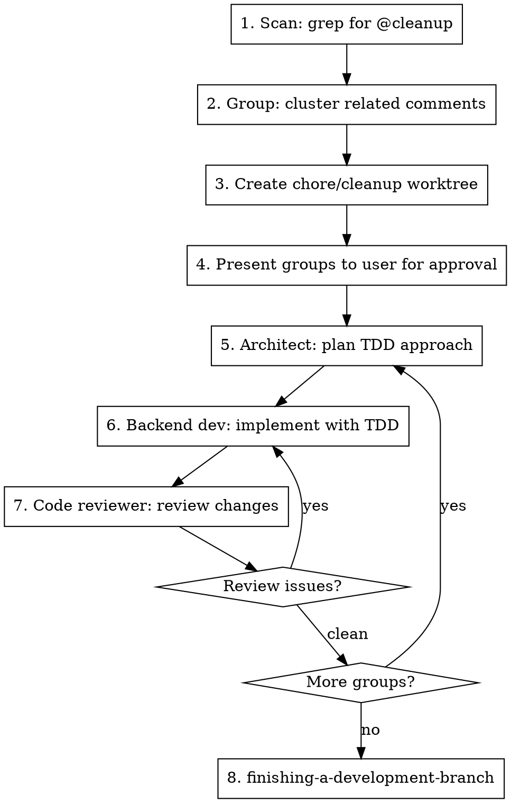

# Cleanup

Process `// @cleanup` comments left in code through a structured architect-implement-review pipeline.

## Workflow



## Step 1: Scan

```bash
grep -rn "@cleanup" src/ tests/ --include="*.cs" --include="*.ts" --include="*.tsx"
```

If no `@cleanup` comments found, tell the user and stop.

## Step 2: Group

Cluster comments that are logically related:
- Same file or closely related files (e.g., endpoint + its validator + its tests)
- Same concern (e.g., multiple "rename X" comments across files)
- Dependencies (comment B depends on comment A being done first)

Each group gets a short name and a one-line summary.

## Step 3: Create Worktree

Use `superpowers:using-git-worktrees` to create `.worktrees/chore/cleanup`.

## Step 4: Present Groups

Show the user all groups with their comments before starting work. Example:

```
Found 7 @cleanup comments in 3 groups:

Group 1: "Rename FooService to BarService" (3 comments)
  - src/backend/.../FooService.cs:42 — @cleanup rename to BarService
  - src/backend/.../FooEndpoint.cs:15 — @cleanup update injection after rename
  - tests/.../FooServiceTests.cs:8 — @cleanup update after rename

Group 2: "Remove dead code in TeeTimeHandler" (2 comments)
  - src/backend/.../TeeTimeHandler.cs:88 — @cleanup remove unused method
  - src/backend/.../TeeTimeHandler.cs:102 — @cleanup remove unused method

Proceed with all groups? Or adjust grouping?
```

Wait for user approval before continuing.

## Step 5-7: Process Each Group

For each group, run three agents sequentially:

### 5. Architect Agent

Dispatch `architect` subagent with:

```
You are planning a cleanup task in the chore/cleanup worktree at: {worktree_path}

## Cleanup Group: "{group_name}"

These @cleanup comments need to be addressed:
{list each comment with file:line and full comment text}

## Your Task

1. Read the files containing the @cleanup comments and understand the surrounding code
2. Determine what changes are needed to address each comment
3. Plan a TDD approach: what tests need to be written or modified FIRST, then what implementation changes follow
4. Consider ripple effects — other files that reference the code being changed
5. Output a numbered implementation plan with specific files and changes

Keep the plan minimal — address exactly what the @cleanup comments ask for, nothing more.
```

### 6. Backend Developer Agent

Dispatch `backend-developer` subagent with:

```
You are implementing a cleanup task in the chore/cleanup worktree at: {worktree_path}

## Cleanup Group: "{group_name}"

## Architect's Plan
{paste architect's plan output}

## Your Task

1. Follow the architect's plan using TDD — write/modify tests first, verify they fail, then implement
2. Remove each @cleanup comment after addressing it
3. Run `dotnet build shadowbrook.slnx` to verify compilation
4. Run relevant tests to verify they pass
5. Run `dotnet format shadowbrook.slnx` to fix style
6. For TypeScript changes: run `pnpm --dir src/web lint` and `pnpm --dir src/web test`

Do NOT commit — changes will be committed after review.
```

### 7. Code Reviewer Agent

Dispatch `reviewer` subagent with:

```
You are reviewing cleanup changes in the chore/cleanup worktree at: {worktree_path}

## Cleanup Group: "{group_name}"

## What Was Planned
{paste architect's plan output}

## Your Task

Review the uncommitted changes (git diff) against the plan:
1. Were all @cleanup comments addressed and removed?
2. Do the changes match what was planned — no more, no less?
3. Are there any bugs, missed references, or broken tests?
4. Run tests to confirm they pass

If issues found, list them clearly. If clean, say "LGTM".
```

**If reviewer finds issues:** Feed the issues back to the backend developer agent for another pass, then re-review. Max 2 rounds — if still failing, stop and report to user.

**If reviewer says LGTM:** Commit the group's changes with message: `chore: {group_name}` and move to next group.

## Step 8: Finish

After all groups are processed, use `superpowers:finishing-a-development-branch` to push and PR.

## Commit Strategy

One commit per cleanup group, all on the same `chore/cleanup` branch. The PR contains all groups.

## Red Flags

- **Never expand scope** beyond what the `@cleanup` comment asks for
- **Never leave `@cleanup` comments** in code after processing — every comment must be addressed or explicitly flagged as skipped with a reason reported to the user
- **Never skip the architect step** even for "simple" cleanups — the plan prevents scope creep and catches ripple effects
