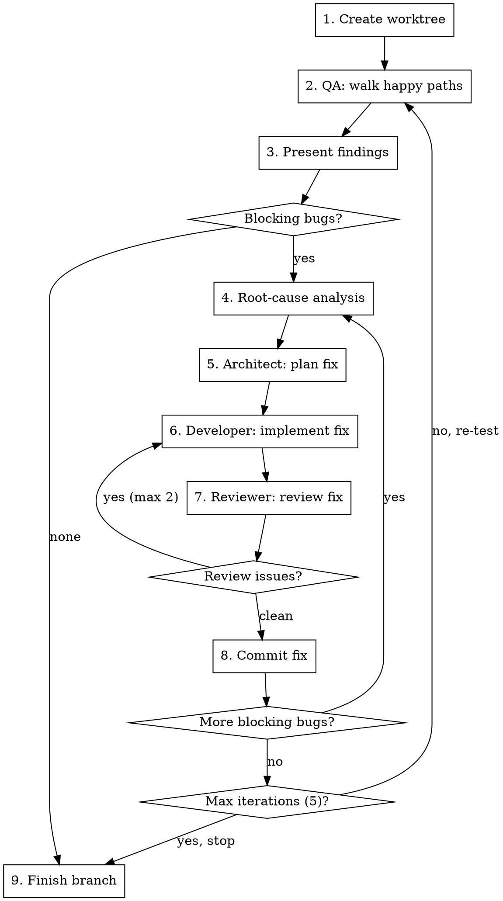

# Local QA

Exploratory QA against the running local app. Finds broken happy paths and fixes them through the full agent pipeline — all in an isolated worktree. Loops until happy paths work.

## Usage

- `/local-qa` — run a full cycle
- `/local-qa --headed` — run with visible browser
- `/local-qa --skip-qa` — skip QA, resume fixing from a previous findings log

## Prerequisites

The app must be running locally before invoking this skill. Check that both are reachable:

```bash
curl -sf http://localhost:5221/health > /dev/null 2>&1 && echo "API: up" || echo "API: down"
curl -sf http://localhost:3000 > /dev/null 2>&1 && echo "Web: up" || echo "Web: down"
```

If either is down, tell the user: "Run `make dev` first — the app needs to be running locally." Stop.

## Workflow



## How-To Skills

The QA agent maintains a library of reusable how-to skills in `.claude/skills/how-tos/`. Each file documents one discrete flow (e.g., `create-a-golfer.md`, `post-a-tee-time.md`).

**Naming:** `{verb}-a-{noun}.md`

**Structure:**

```markdown
---
name: how-tos:{flow-name}
description: Use when you need to {do X} in the Teeforce app running locally
---

# {Flow Name}

## Prerequisites
- **Required data:** {org must exist, course must exist, etc.}
- **Required role/page:** {must be logged in as admin, start from /admin/courses}
- **Depends on:** {link to other how-to if this flow requires a prior flow}

## Steps
1. Navigate to {url}
2. Click {element}
3. Fill in {field} with {example valid value}
4. ...
5. Verify: {what success looks like — toast, redirect, data appears}

## Notes
{Any gotchas, e.g. "slug is auto-generated from name"}
```

## Step 1: Create Worktree

Use `superpowers:using-git-worktrees` to create a worktree on `bug/local-qa-{YYYY-MM-DD}`.

All subsequent agent work happens in this worktree.

## Step 2: QA — Walk Happy Paths

First, read `.local/test-credentials.md` from the repo root to get test account credentials.

Dispatch a `qa-tester` subagent with this prompt (include the credentials content):

```
You are doing exploratory QA on the Teeforce tee time booking app running at http://localhost:3000 (API at http://localhost:5221).

## Test Credentials

{paste full contents of .local/test-credentials.md here}

Log in with the appropriate test account before starting your exploration. Pick the role that best fits the flows you're testing (e.g., operator credentials for course management flows, admin credentials for organization management).

Your goal: walk every happy path you can find and verify it works. You are NOT looking for edge cases, security issues, or adversarial inputs. You are checking: "Can a user complete the core flows?"

## Before You Start

Read any existing how-to files in `.claude/skills/how-tos/*.md`. These document known flows and their expected steps. Use them as a baseline — you know what flows exist and what to expect. If no how-tos exist yet, explore from scratch.

## How to Explore

1. Start at the root URL. Take a snapshot of what you see.
2. Navigate to every page reachable from the UI (links, nav, buttons).
3. On each page, try the primary action — the thing the page exists for:
   - If it's a list page: does it load data? Can you click into items?
   - If it's a form: fill it out with valid data and submit. Does it succeed?
   - If it's a detail page: does it display correctly? Do actions work?
4. Follow the natural user journeys end-to-end:
   - Golfer: browse → find tee times → book → see confirmation
   - Operator: manage course → configure settings → view bookings
   - Admin: manage organizations → invite users → manage courses
5. Check the browser console for errors after each page load and action.

## Screenshots

Take screenshots at notable moments and save them to `docs/qa/screenshots/{YYYY-MM-DD}/`:
- **Successful flows:** initial page, filled form, success confirmation (e.g., `create-a-golfer-form.png`, `create-a-golfer-success.png`)
- **Bugs:** the broken state, error messages, console errors (e.g., `book-a-tee-time-500-error.png`)

Reference screenshot paths in your report output.

## Maintaining How-To Skills

After you **successfully complete** a flow:

1. Check if a how-to exists in `.claude/skills/how-tos/` for that flow.
2. **If no how-to exists:** Create one following the template in the How-To Skills section above. Include the prerequisites, exact steps you followed, and any gotchas you noticed.
3. **If a how-to exists but steps differ** from what you observed (new fields, different URLs, changed flow): Update it to match the current state.
4. Do this inline — immediately after completing the flow, while steps are fresh.

## What to Report

For each issue found, categorize it:

- **BLOCKING** — A happy path is broken. The user cannot complete a core flow. Examples: page crashes, form submits fail, navigation leads nowhere, data doesn't load, blank pages.
- **MINOR** — Something is off but the flow still works. Examples: styling glitch, missing loading spinner, placeholder text, minor layout issue.

## Browser Mode

{Use headed mode | Use headless mode (default)}

## Output Format

Return this exact structure:

~~~markdown
## Exploratory QA Report

**Environment:** http://localhost:3000
**Date:** {date}
**Overall:** {PASS — all happy paths work | FAIL — blocking issues found}

### Pages Visited
- {url} — {status: OK | ISSUES}

### Blocking Issues
1. **{short title}**
   - **Page:** {url}
   - **Flow:** {what the user was trying to do}
   - **Expected:** {what should happen}
   - **Actual:** {what actually happened}
   - **Console errors:** {any relevant JS/API errors, or "None"}
   - **Screenshot:** {path}

### Minor Issues
1. **{short title}**
   - **Page:** {url}
   - **What:** {brief description}
   - **Screenshot:** {path}

### Happy Paths Verified
- {flow description} — PASS

### How-Tos Created/Updated
- {file path} — {created | updated: what changed}
~~~
```

Adjust the browser mode line based on whether `--headed` was passed.

## Step 3: Present Findings

Show the user the QA report summary:

```
QA Pass #{N}: Found {X} blocking issues, {Y} minor issues.

Blocking:
1. {title} — {one-line summary}
2. ...

Minor (logged, not fixing this cycle):
1. {title} — {one-line summary}

Proceeding to fix {X} blocking issues.
```

**Log minor issues** to a file in the worktree: `docs/qa/local-qa-{date}.md`. Append to this file on each QA pass. These are tracked but not fixed in this cycle.

If no blocking issues: skip to Step 9.

## Step 4: Root-Cause Analysis

For each blocking bug, dispatch an `Explore` subagent (subagent_type: `general-purpose`) to investigate:

```
A QA tester found this bug in the Teeforce app:

**Bug:** {title}
**Page:** {url}
**Flow:** {what the user was trying to do}
**Expected:** {expected}
**Actual:** {actual}
**Console errors:** {console errors}

Your job: find the root cause in the codebase. Do NOT fix it — just diagnose.

1. If there are console errors or API errors, trace them to the source code
2. Search for the relevant endpoint, component, or handler
3. Read the code and identify WHY it fails
4. Check for missing data, broken queries, incorrect routing, unhandled states, etc.

Report back with:
- **Root cause:** one-paragraph explanation of what's wrong
- **Files involved:** list of files that need to change
- **Severity assessment:** is this a simple fix (typo, missing null check) or a deeper issue (missing feature, broken data model)?
```

## Step 5: Architect Plans the Fix

Dispatch an `architect` subagent:

```
You are planning a bug fix in the Teeforce app. Work in the worktree at: {worktree_path}

## Bug
{title}: {one-line summary}

## Root Cause
{root-cause agent's findings — full output}

## Your Task

1. Read the files identified in the root cause analysis
2. Verify the root cause is correct — if not, note what's actually wrong
3. Plan the fix with a TDD approach: what tests verify the fix, then what code changes
4. Keep the fix minimal — address exactly the bug, nothing more

Output a numbered implementation plan with specific files and changes.
```

## Step 6: Developer Implements the Fix

Determine which developer to dispatch based on the files involved:
- `.cs` files → `backend-developer`
- `.ts` / `.tsx` files → `frontend-developer`
- Both → dispatch backend first, then frontend sequentially

Dispatch the appropriate developer subagent:

```
You are fixing a bug in the Teeforce app. Work in the worktree at: {worktree_path}

## Bug
{title}: {one-line summary}

## Architect's Plan
{paste architect's plan output}

## Your Task

1. Follow the architect's plan — write/modify tests first, verify they fail, then implement the fix
2. Run `dotnet build teeforce.slnx` to verify compilation (for backend changes)
3. Run relevant tests to verify they pass
4. Run `dotnet format teeforce.slnx` to fix style (for backend changes)
5. For TypeScript changes: run `pnpm --dir src/web lint` and `pnpm --dir src/web test`

Do NOT commit — changes will be committed after review.
```

## Step 7: Reviewer Reviews the Fix

Dispatch a `reviewer` subagent:

```
You are reviewing a bug fix in the Teeforce app. Work in the worktree at: {worktree_path}

## Bug
{title}: {one-line summary}

## Root Cause
{root-cause summary}

## Architect's Plan
{architect's plan output}

## Your Task

Review the uncommitted changes (git diff) against the plan:
1. Does the fix address the root cause?
2. Do the changes match what was planned — no more, no less?
3. Are there any regressions, missed references, or broken tests?
4. Run tests to confirm they pass

If issues found, list them clearly. If clean, say "LGTM".
```

**If reviewer finds issues:** Feed the issues back to the developer agent for another pass, then re-review. Max 2 rounds — if still failing, stop and report to user.

**If reviewer says LGTM:** Move to Step 8.

## Step 8: Commit the Fix

Commit with message format:

```
fix: {short description of what was broken}
```

Use the standard commit process. One commit per bug fix.

## Loop Control

After all blocking bugs from a QA pass are fixed and committed:

1. Check iteration count. If this was QA pass #5, stop and go to Step 9.
2. Otherwise, loop back to Step 2 — run QA again to verify fixes and discover new issues.

Tell the user between passes:

```
QA Pass #{N} complete. Fixed {X} bugs. Running QA again to verify fixes...
```

## Step 9: Finish

When QA finds no blocking issues (or max iterations reached):

1. If max iterations reached with remaining bugs, tell the user what's still broken.
2. Log final status to `docs/qa/local-qa-{date}.md`.
3. Use `superpowers:finishing-a-development-branch` to handle the branch (push, PR, or merge).

## Resume Mode (--skip-qa)

When `--skip-qa` is passed:

1. Look for the most recent `docs/qa/local-qa-*.md` file
2. Read the blocking issues that haven't been fixed yet
3. Start from Step 4 (root-cause analysis) for the remaining issues
4. After all are fixed, run QA normally from Step 2

## Constraints

- **Happy paths only** — the QA tester is NOT doing adversarial or edge-case testing
- **Minimal fixes** — fix exactly the bug, don't refactor surrounding code
- **One commit per bug** — keep the git history clean and bisectable
- **Never skip root-cause** — even for "obvious" bugs, the explore step prevents fixing symptoms
- **Never skip review** — every fix gets reviewed before committing
- **Max 5 QA passes** — prevents infinite loops if bugs keep appearing
